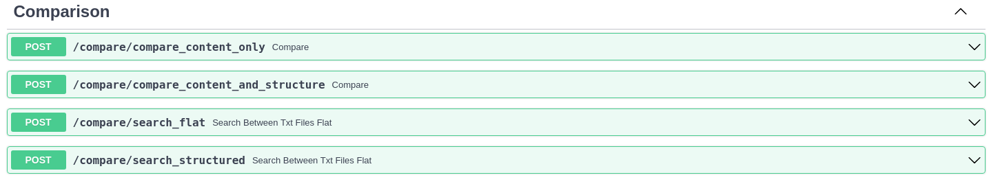
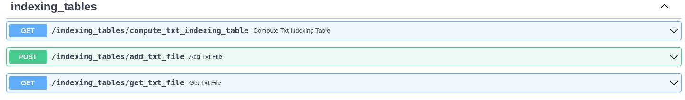

# VSM Similarity Based Approach

This repository serve as the backend for the Vector Similarity Method (VMS) application developed im the IDPA Course:
Fall 2023. It provides multiple endpoints to be called from the frontend, as well as a swagger to simplify the process
of calling the provided services.

## Technologies used

- nltk
- FastAPI (API framework)

## Installation

Clone the repo and install all the requirements to get the dependencies needed.
We advise to create a virtual environment with python 3.8 as interpreter.

```bash
pip install -r ./docker/requirements.txt
```

## Project Structure

```bash
.
├── api
│   └── controllers
├── application
│   └── comparison
├── data
│   ├── csvs
│   ├── indexing_tables
│   ├── txt_documents
│   ├── uploaded_files
│   └── xml_version_of_txt 
├── domain
│   ├── contracts
│   ├── exceptions
│   └── models
├── persistence
│   └── services
├── shared
│   └── helper
├── containers.py
├── main.py
└── README.md
```

## Dataset Folder Structure

The following is an example of how the **txt_documents** folder will be structured:

```sh
├──data/
    └── txt_documents
        ├── flat
        └── structured             
```

*This folder will hold both the flat (free text) and the semi-structured documents as part of our collection of
documents. The flat dataset has been fetched from kaggle: https://www.kaggle.com/datasets/michaelarman/poemsdataset*

## Usage

As the application uses nltk library, you will need to specify the path where the dependencies will be stored. run the
following command after downloading the requirements:

```bash
export NLTK_DATA="./nltk"
```

In the root directory of the project, type the following command in the terminal

```bash
python3 main.py
```

this will start the API at port 2000. For easier visualization, surf to http://localhost:2000/docs
This will give a simple representation of the available endpoints.

Endpoint services can be divided into 2 categories:

1. Comparison and Search services
2. Indexing Table services


### Comparison Services

These endpoints provide different functionalities related to comparison and search . A detailed documentation has been
provided under each endpoint using Swagger.


### Indexing Table Services




